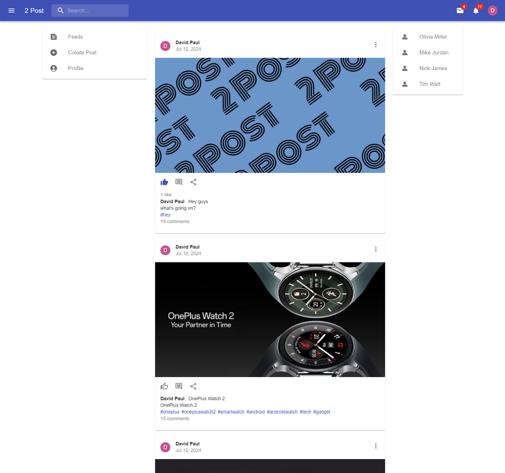
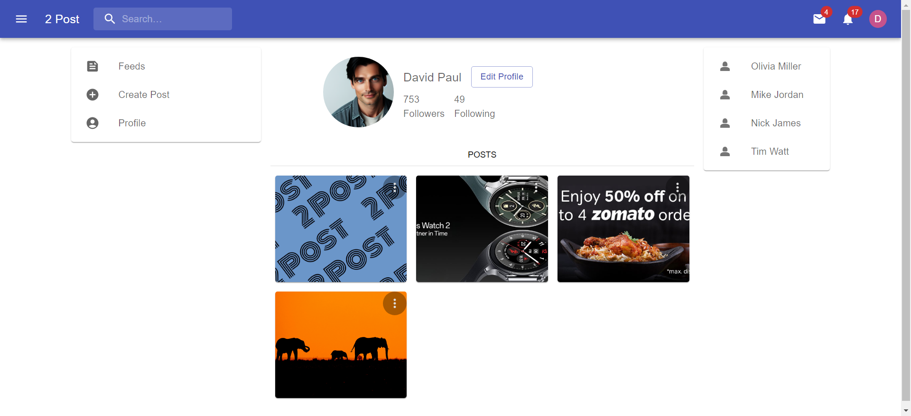

# MERN Social Media App with using MUI 

*To start application: You have to install first NodeJS from here [NodeJS download](https://nodejs.org/en/download/prebuilt-installer) in your system and after installation follow these steps as below*

1. Clone this repo by the command 

```bash
git clone -b dev https://github.com/anishVermaIsHere/social-media.git
```
2. Create `.env` file in `client` folder.

```bash
VITE_BASE_URL='http://localhost:5000'
```
3. And also create another `.env` file into `api` folder.

```bash
SERVER_PORT=5000
CORS_ORIGIN='http://localhost:5173' or <YOUR_DOMAIN>
DB_URI=<YOUR_DATABASE_URI>

SALT=10
ACCESS_TOKEN_SEC_KEY=<YOUR_KEY>
REFRESH_TOKEN_SEC_KEY=<YOUR_KEY>
ACCESS_TOKEN_EXPIRY='1h'
REFRESH_TOKEN_EXPIRY='7d'


CLOUDINARY_API_KEY=<YOUR_API_KEY>
CLOUDINARY_API_SEC_KEY=<YOUR_API_SEC_KEY>
CLOUDINARY_CLOUD_NAME=<YOUR_CLOUD_NAME>

```

4. Then start `client` app with command 

```bash
npm run dev
```
5. And start `api` server app with command 

```bash
npm start
```
6. Your app will run successfully.


 **ScreenShot**

 

 


